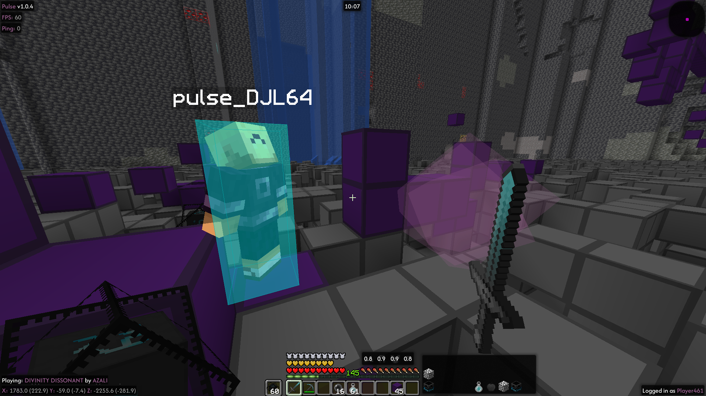
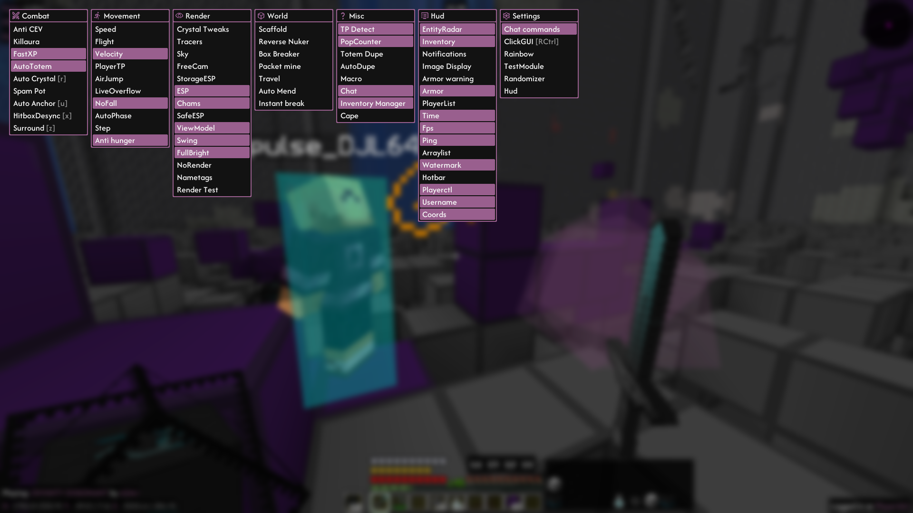
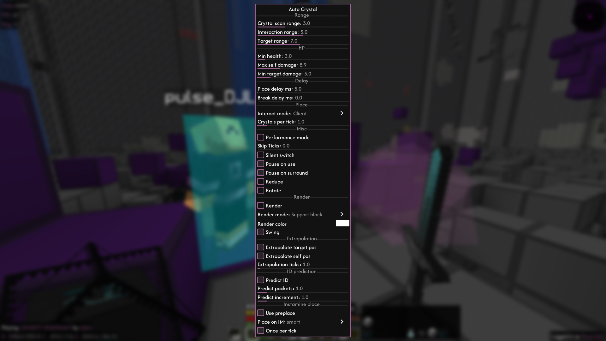

# Pulse client
Anarchy / utility client for Fabric 1.21.1 \
Created for playing on `play.dupeanarchy.com` \
The code quality is dogshit, with some rare exceptions
where it's even more dogshit (see [ModuleWidget.java](https://github.com/Pulse-Client-Dev/Pulse-Client/blob/master/src/main/java/xyz/qweru/pulse/client/render/ui/gui/widgets/ModuleWidget.java)) \
Feel free to open pull requests.
## UI

## Usage
### Installation
1. Clone the repository
2. Run `./gradlew genSources`
3. Run `./gradlew build`
4. Client jar is in `build/libs/pulseclient-???.jar` (not `..-sources.jar`)

### Optional dependencies
* Playerctl (linux only) has to be installed to use the playerctl hud module

### Binds
* Open gui - RControl (can be changed by binding the clickgui module to something else)
* Toggle module - Mouse 1
* Open module settings - Mouse 2
* Bind module - Mouse 3 (middle click)
* Move categories - LControl + Mouse 1
* Direct input for number / text settings - double click
## Credit
### Clients
* event system - https://github.com/MeteorDevelopment/orbit
* discord rpc - https://github.com/JnCrMx/discord-game-sdk4j
* 3d renderer - https://github.com/0x3C50/Renderer
* part of 2d renderer - https://github.com/Pan4ur/ThunderHack-Recode
* damage utils - https://github.com/MeteorDevelopment/meteor-client/
* misc. utils - Lumina Client premium
### People
* \_qweru\_ (me) - created the client
* k2enny - minor radar fixes, cape module
## License
GPL3